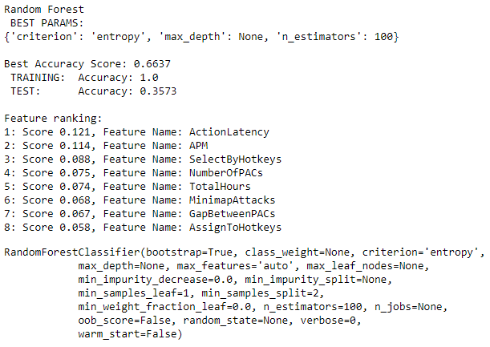
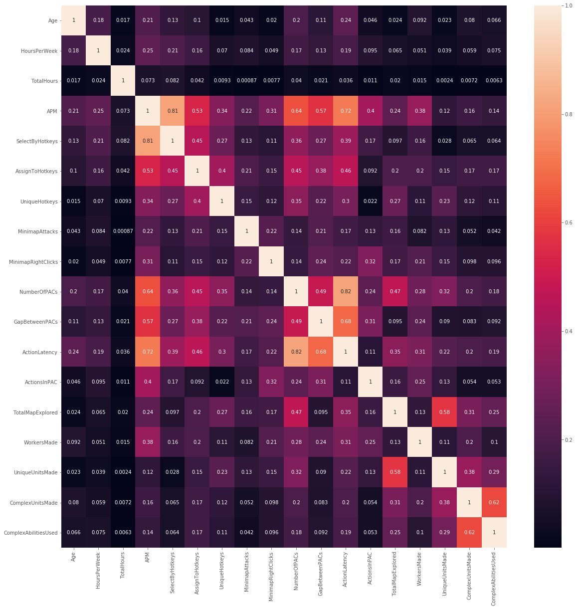
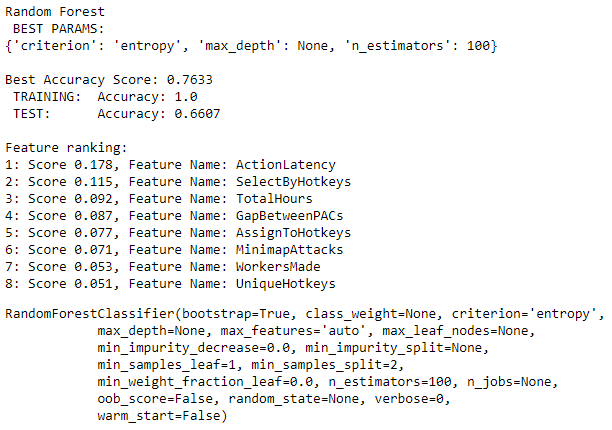
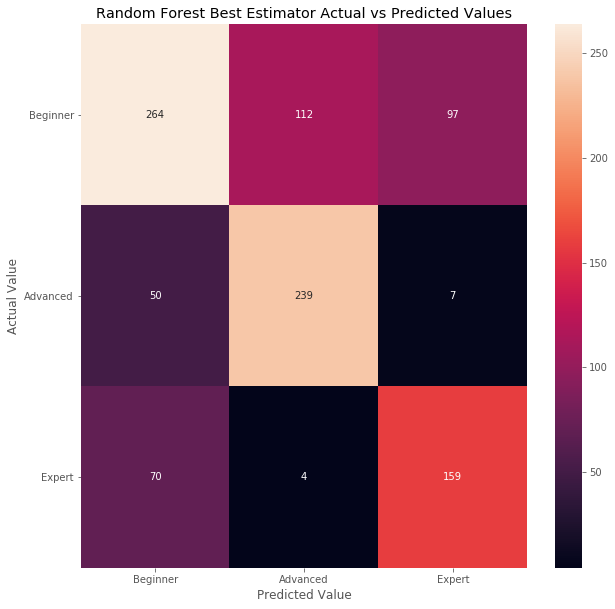

# Module 5 Project
### Machine Learning Classification

## Introduction
This project is an analysis of a number of Starcraft 2 players. The goal is to classify them into their appropriate league based on their playing statistics and habits. In total, there are 7 leagues in the Starcraft 2 ladder: Bronze, Silver, Gold, Platinum, Diamond, Master, and Grandmaster. For the purposes of the final results, they are separated into three groups: Bronze, Silver, and Gold are in the Beginner group, Platinum and Diamond are in the Advanced tier, and Master and Grandmaster are in the Expert tier.

Dataset Source: https://www.kaggle.com/danofer/skillcraft/data#SkillCraft.csv

## Methodology
This particular dataset was rather robust in the number of features it included, and surprisingly had no missing information, making the cleaning of the data rather easy. I was able to very easily separate the data into a feature database and a target database, the latter comprising only of the League data for a given player.

After separating the data, I created a train-test split, and due to the vast difference between the number of players in each tier (the Grandmaster tier only ever has a total of 200 players on it, so as one player obtains this rank, another loses it, and of those 200 players, only 35 are in this database, while the Platinum and Diamond tiers each have around 800 players in this database) I then used SMOTE to synthetically equalize each tier in my training feature database.

From there, I normalized my equalized training feature database and testing feature database separately (to avoid data-bleed between the two) and then began running various different models to find which model worked best.

Initially, my best model was around 35% accuracy, even after removing some multi-collinear features, and running PCA so I reduced my number of classes into Beginner, Advanced, and Expert tiers, as mentioned above. This nearly doubled my accuracy scores immediately, and in the end I was able to achieve an accuracy score of around 66%.

#### Initial Model
This is prior to reducing the number of classes or any removal of multi-collinear features.

#### Correlation Matrix
This was used along with the Feature Ranking from the initial model to select appropriate features to remove based on largest amount of multi-collinearity with least effect on the model.

#### Final Model
This is after reducing the classes down to three, and removing the APM, NumberOfPACs, and ComplexUnitsMade features.

#### Confusion Matrix
This shows that a majority of the misclassifications were in the Beginner tier, as explained in the Results below.

## Results
My best model in the end was a Random Forest, after reducing the number of classes and removing the three worst multi-collinear features based on which features affected the model the least by comparison. This model's accuracy score was 66%, however, most of the misclassifications occurred in the Beginner tier. I believe the reason for this is that there are a number of players that have the ability and statistics to play in higher tiers, but for whatever reason are not able to devote the necessary time to achieve the higher ranks and thus are stuck in the Bronze, Silver, or Gold leagues. Because of these anomalies, I'm ok with this level of accuracy in my model. For now, at least.

## Future Work
In the future I would like to find a way to improve that accuracy even more, perhaps by reducing the weight of the Total Hours feature to allow the model to focus more on the stats of the players than the time they're able to put into the game.

I would also like to create a model for each tier to try and further classify them into their appropriate League, rather than just their overall grouping.
